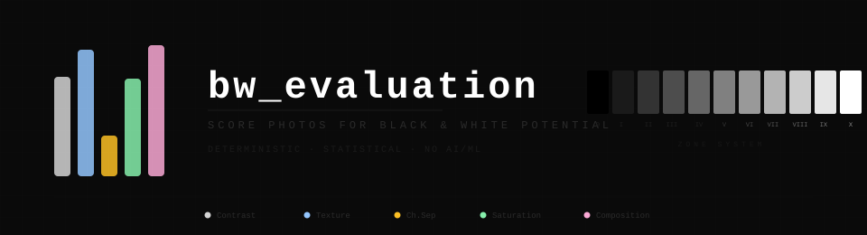

[](https://www.python.org)
[](https://opencv.org)
[](LICENSE)

---

A CLI tool for pre-filtering and ranking the best black & white candidates from large photo collections. Feed it a folder, get back a scored and sorted `results.json` — or an interactive HTML report you can filter, sort, and compare in your browser.

> **Not a replacement for your eye** — this is a triage tool to surface the most promising shots from hundreds or thousands of photos. Manual review is still required.

## How scoring works

Each photo is scored **0–100** as a weighted sum of five dimensions:

| Dimension | Weight | What it measures |
|:--|:-:|:--|
| **Contrast** | 35% | Histogram spread, deep blacks & bright whites, dynamic range, light/dark balance |
| **Texture** | 25% | Edge density (Sobel + Canny), local variance, Laplacian sharpness |
| **Channel separation** | 25% | Per-pixel RGB divergence — high separation = more creative B&W mixing potential |
| **Saturation** | 10% | Inverse mean saturation — less color = more naturally suited for B&W |
| **Composition** | 5% | Region luminosity variation, highlight distribution |

All weights and sub-parameters are configurable via `--config config.json`.

## Quick start

```bash
# Zero-install — runs directly without cloning
uvx bw-evaluation score -i photos/

# Or install locally
uv sync
bw score -i photos/
```

**Score** a folder of photos:
```bash
bw score -i photos/
```

**Generate an interactive HTML report** with thumbnails:
```bash
bw report-html
```
Opens in any browser, fully offline. Features:
- **Filter** by score range (min/max sliders)
- **Sort** by total score or any individual dimension
- **Search** filenames
- **Compare** two photos side-by-side with color-coded dimension deltas
- **Live stats** bar with photo count, average score, and score distribution histogram

Use `--max-photos N` to limit to top N.

**View** text score distribution:
```bash
bw report
```

### All scoring options

| Flag | Default | Description |
|:--|:-:|:--|
| `-i, --input-dir` | `photos/` | Input directory |
| `-o, --output` | `results.json` | Output file |
| `-w, --workers` | `1` | Parallel workers |
| `--config` | — | JSON config override |
| `-v, --verbose` | — | Debug output |
| `-q, --quiet` | — | Warnings only |

## Development

```bash
uv sync --group dev
pre-commit install
```

All quality checks run on every commit via [pre-commit](https://pre-commit.com/):

| Hook | Tool | Strictness |
|:--|:--|:--|
| Lint | ruff (`select = ["ALL"]`) | Every rule enabled, minimal justified ignores |
| Format | ruff format | Double quotes, 88-char lines, strict defaults |
| Type check | mypy `--strict` | Strict mode + `warn_unreachable` |
| Tests | pytest | Full suite including golden reference locks |

CI runs the same checks via `uv run pre-commit run --all-files`.

## Docker

```bash
docker build -t bw-eval .
docker run --rm -v "$PWD:/app" bw-eval score -i photos/
docker run --rm -v "$PWD:/app" bw-eval report-html
docker run --rm -v "$PWD:/app" bw-eval report
```

## License

[MIT](LICENSE)
